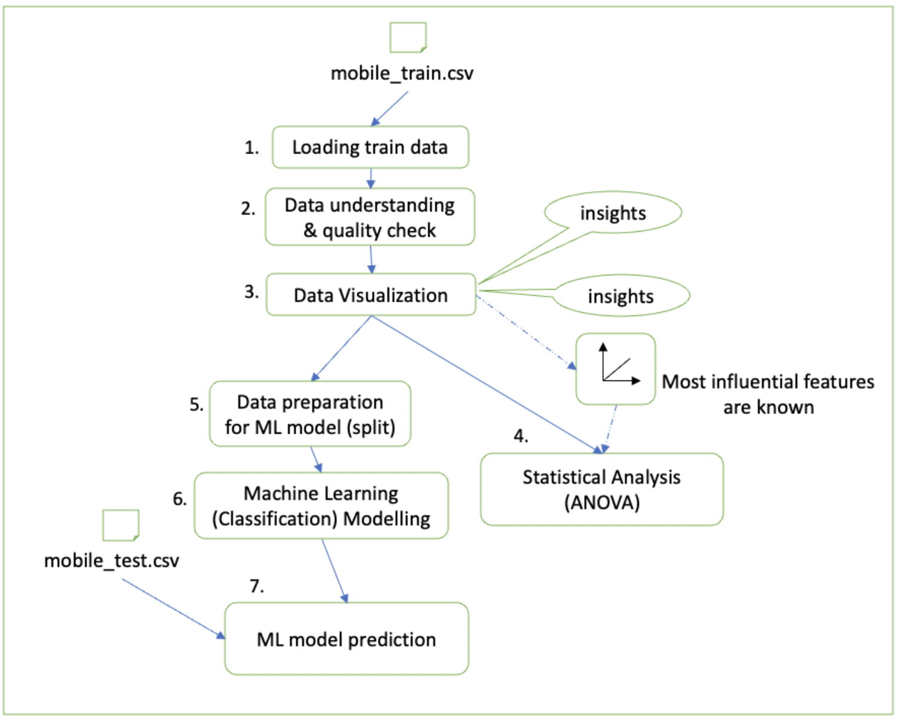

# Mobile Phones Price-range Prediction

# Project Plan

## The Data (10 marks)

The data considered for "Mobile phone feature's analysis and price-range classification" is taken from www.kaggle.com:
https://www.kaggle.com/iabhishekofficial/mobile-price-classification

The data is divided into two .CSV files.
    
   1. mobile_train.csv
        * Size: ~62K
        * Rows: 2000
        * Columns: 21
   2. mobile_test.csv
        * Size: ~120K
        * Rows: 1000
        * Columns: 21

The data used to analyse inter-relationship between features and their relation to price_range is "mobile_train.csv". This data is later used for training a classification model (price_range as target variable). The data "mobile_test.csv" is used as a test-set to our classification model.

Each row in the data files contains information about a mobile phone, its features and price-range. The columns represent a list of different features that the mobile phone possesses or is expected to possess. 

The columns in "mobile_train.csv" are 
battery_power, blue, clock_speed, dual_sim, fc, four_g, int_memory, m_dep, mobile_wt, n_cores, pc, px_height, px_width, ram, sc_h, sc_w, talk_time, three_g, touch_screen, wifi, price_range.

And the columns in "mobile_test.csv" are 
id, battery_power, blue, clock_speed, dual_sim, fc, four_g, int_memory, m_dep, mobile_wt, n_cores, pc, px_height, px_width, ram, sc_h, sc_w, talk_time, three_g, touch_screen, wifi. 

It must be noted that the file "mobile_train.csv" does not have 'Id' column and the file "mobile_test.csv" does not have 'price_range' column. 

A description of all the columns are given below:
1. Id: Unique identifier for each column.
2. battery_power: It is the energy(mAh) that battery of the mobile phone can store.
3. blue: It indicates whether the phone has bluetooth or not.
4. clock_speed: Microprocessor's speed of the phone.
5. dual_sim: It indicates whether the phone has dual sim or not
6. fc: It is the Megapixels of the front camera of the phone.
7. four_g: It indicates whether the phone supports 4g or not.
8. int_memory: It is the internal memory of the phone in GBs (Gigabytes).
9. m_dep: Depth(cms) of mobile phone.
10. mobile_wt: weight(gms) of mobile phone.
11. n_cores: Number of cores in the processor.
12. pc: It is the Megapixels of the primary camera of the phone. 
13. px_height: Pixels resolution's height of the mobile phone.
14. px_width: Pixels resolution's weight of the mobile phone.
15. ram: Ram of the mobile phone in MBs (Megabytes) 
16. sc_h: Screen height(cms) of the mobile phone. 
17. sc_w: Screen width(cms) of the mobile phone.
18. talk_time: Time for which a battery lasts.
19. three_g: It indicates whether the phone supports 3g or not 
20. touch_screen: It indicates whether the phone is a touch-screen or not.
21. wifi: It indicates whether the phone has wifi built-in.
22. price_range: Indicates the price-range the phone falls in (1 - low price, 2 - medium price, 3 - high price, 4 - very high price).

The data is accurate when measured against our aim which is to analyse how different features  affect the price of a mobile phone and inter-relationship between the features.

_where it comes from, what data it contains, is it accurate. (Potentially you could create data from a simulation but you should still explain why and how you indend to generate this data.) 300-400_

## Project Aim and Objectives (5 marks)

The aim of the project is to understand the relationship between different Mobile phone features and also their relationship with the price-range of the mobile phone.

To use data cleaning, data visualisation python tools/libraries. To get an idea and find correlation between features, and also with price-range.

And by making use of statistical concepts such as ANOVA (using python statistical libraries) we intend to investigate and find answers for some general questions on relationship between most influencing features on price_range. An example of that will be to answer a question similar to: Does mobile battery power affect the Price? Or Does mobile size have any impact on Price?

By using the knowledge gained during these process, we then intend to develop a Machine-Learning Classification model which will help us in knowing the price-range (i,e it will help us know whether the mobile phone will have a "low" or "medium" or "high" or "very high" price) of a mobile phone when its features are listed as input to the model.

### Specific Objective(s)

* __Objective 1:__ To check relationship between different features in order to find the most influencing features to price-range. (Data Cleaning, Understanding & Visualisation)
* __Objective 2:__ To use statistical tools (ANOVA) to test our analysis and confirm our findings.
* __Objective 3:__ To find and develop the best (most-accurate) Machine Learning classification model to determine mobile phone's price-range.

## System Design (5 marks)

### Architecture

The architecture diagram can be understood in the following steps:
1. Loading train data - the data "mobile_train.csv" is loaded as a pandas Dataframe.
2. Data understanding & quality check - For understnding the data, Data summaries and information are listed and checked. A quality check for the data is done and checks are done for outliers, missing values, inconsistent values, special values and duplicate values etc. 
3. Data Visualisation - features in the data are visualised and relationship between features and target are realised. important insights from it are noted down and the most influential features to target variable (price-range) are noted..
4. Statistical Analysis (ANOVA) - The most influencial features are tested against the target variable and hypothesis testing are done to determine that the target variable are in reality effected by those features.
5. Data Preparation for ML model (split) - the data is checked for any descrepencies once again and is splitted further into training set and validation set.
6. Machine Learning (Classification) Modelling - A machine learning classification model is trained on the train set and validated on the validation set. Various different algorithms are compared in order to get the best model.
7. ML Model Prediction - The model is used to de prediction by loading and giving as input the "mobile_test.csv" data. The predicted values are looked to know the respective price_range for each record.
  
### Processing Modules and Algorithms

_Briefly list and describe the most significant computational components of your system and the algorithms you will use to implement them. 
This could include things like:_

* _cleaning the data by removing outliers_
* _combining different datasets_
* _converting samples to a special representaion (such as feature vectors)_
* _constructing a special data-structure (such as a decision tree)_
* _running some kind of analysis_

_Your list can be presented in similar form to the one just given, 
but should include a brief
but more specific description of the components and/or algorithms.
Probably three or four components is sufficient for most projects, but
you may want to have more._
